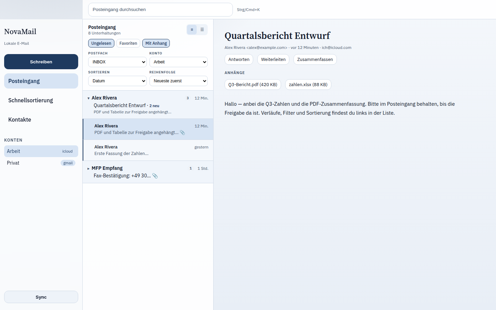
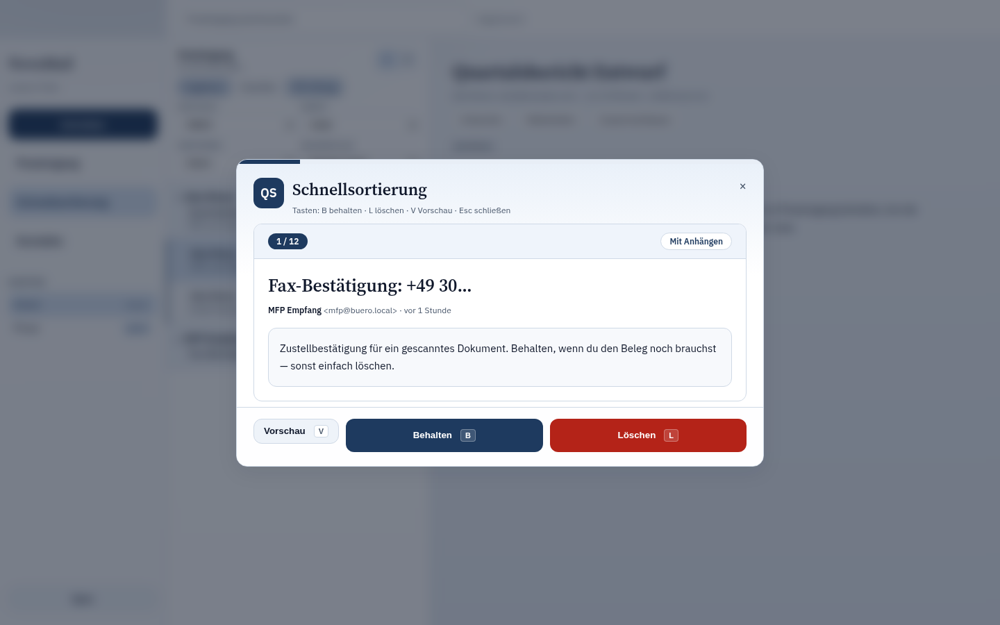
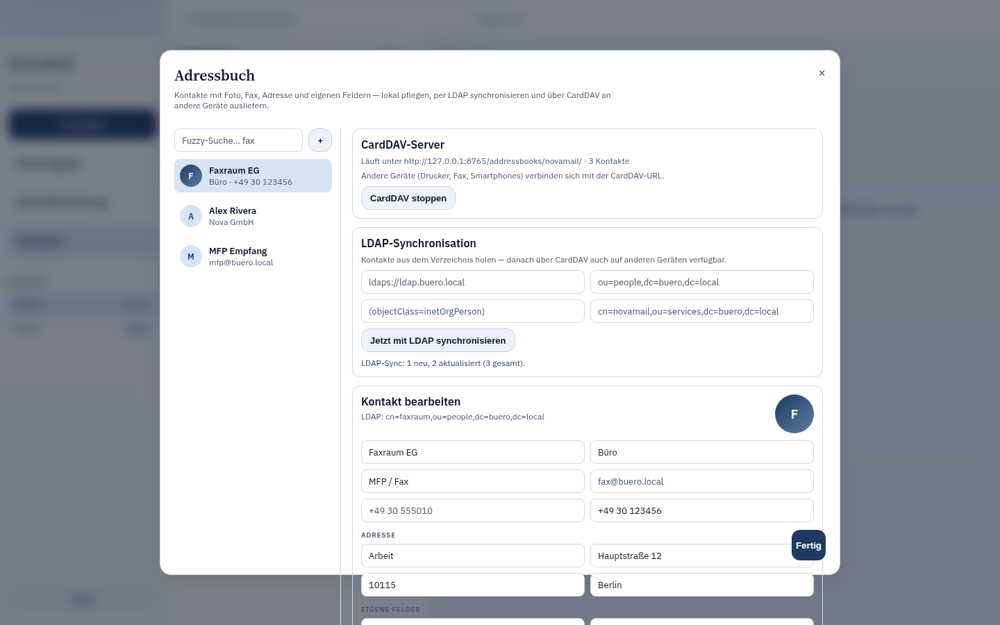

# NovaMail

Modern open-source email for Ubuntu Linux.

NovaMail is a local-first desktop client built with **Tauri 2**, **Rust**, **React**, and **SQLite**. It targets Thunderbird-class capability with Spark-class UX and Outlook-class productivity — without cloud lock-in.

## Features (MVP)

- Multi-account IMAP / SMTP + background sync scheduler
- Unified Inbox (archived mail filtered out)
- Provider presets (Gmail, Microsoft 365, Yahoo, iCloud, Proton Bridge, generic)
- Password auth via OS keyring (+ iCloud app-specific password hint)
- OAuth2 browser sign-in (localhost callback + token exchange)
- Full-text search (SQLite FTS5)
- Compose / reply / forward / archive / delete
- Attachments: sync from IMAP, open locally, attach when sending
- Address book with embedded CardDAV server (MFP/fax sync) + LDAP import
- Quick Sort triage (Keep / Delete / Preview + hotkeys `T`, `K`, `D`, Space)
- Signatures, labels, and rules in Settings
- POP3 connectivity test
- Local AI summarize + suggest reply (Ollama, offline fallback)
- Command palette, settings (theme/density/high contrast)
- Keyboard shortcuts (`c`, `r`, `f`, `e`, `#`, `t`, `j`/`k`, `/`, `Ctrl/Cmd+K`)
- HTML sanitization, CI, Linux packaging script

## Screenshots







More captures: [`docs/screenshots/`](docs/screenshots/).

## Quick start

### Requirements

- Ubuntu 22.04+ / 24.04
- Node.js 20+, pnpm 10+
- Rust stable 1.85+
- System packages: `libwebkit2gtk-4.1-dev`, `libgtk-3-dev`, `librsvg2-dev`, `patchelf`, `libayatana-appindicator3-dev`

```bash
sudo apt install libwebkit2gtk-4.1-dev libgtk-3-dev librsvg2-dev patchelf \
  libayatana-appindicator3-dev libssl-dev
```

### Install & run

```bash
pnpm install
cargo test --workspace
pnpm dev
```

`pnpm dev` launches the Tauri shell with Vite HMR on port `1420`.

### Frontend-only Vite (no mail engine)

```bash
pnpm desktop:dev
```

Serves the React shell without Tauri IPC. Account/mail APIs require `pnpm dev`.

## Workspace layout

```
apps/desktop          Tauri + React app
crates/*              Rust domain crates
packages/ui           Nova design system
packages/hooks        Shared React hooks
docs/                 Architecture & ADRs
```

## Configuration

Optional OAuth client IDs:

```bash
export NOVAMAIL_GOOGLE_CLIENT_ID=...
export NOVAMAIL_MS_CLIENT_ID=...
export NOVAMAIL_YAHOO_CLIENT_ID=...
```

See [`.env.example`](.env.example).

## License

[MPL-2.0](LICENSE)

## Docs

- [Engineering standards](docs/ENGINEERING.md)
- [Architecture](docs/ARCHITECTURE.md)
- [Roadmap](docs/ROADMAP.md)
- [ADR 0001 Architecture](docs/adr/0001-architecture.md)
- [ADR 0002 Security](docs/adr/0002-security.md)
- [ADR 0003 No mock mail data](docs/adr/0003-no-mock-mail-data.md)
- [ADR 0004 Engineering standards](docs/adr/0004-engineering-standards.md)
- [Security policy](SECURITY.md)
