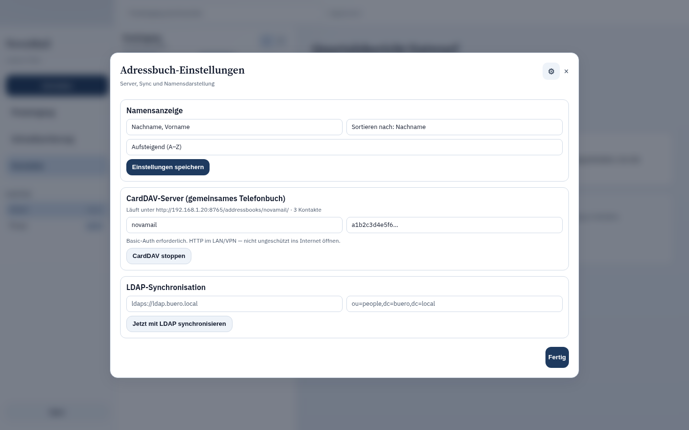

# NovaMail

Modern open-source email for Ubuntu Linux.

NovaMail is a **local-first** desktop client built with **Tauri 2**, **Rust**, **React**, and **SQLite**. It aims for Thunderbird-class capability, Spark-class UX, and Outlook-class productivity — without cloud lock-in.

**Status:** early / shipping. Core mail, contacts (with LAN LDAP/CardDAV hub), calendar, OpenPGP, and local AI are usable day-to-day on Ubuntu. Releases are tagged on GitHub (`v0.1.x` with `.deb` + AppImage). Test coverage is still thin relative to the codebase. Expect rough edges — feedback welcome.

| Area | Maturity |
| --- | --- |
| Mail (sync, compose, Quick Sort, search) | Day-to-day |
| Address book + LAN LDAP/CardDAV hub | Day-to-day |
| Local AI (Ollama summarize / reply / events) | Day-to-day |
| Calendar / OpenPGP / spam / rules | Usable |
| CalDAV write-back, offline quota, FTS depth | Early |
| WASM plugins (`novamail-plugins`) | Scaffold (API stub, not a product surface yet) |

## Product features

### Accounts & sync

- Multi-account IMAP / SMTP
- Provider presets: **Gmail**, **Microsoft 365**, **Yahoo**, **iCloud**, **Proton Bridge**, **generic IMAP/SMTP**
- Password auth via OS keyring (Secret Service); iCloud app-specific password hint
- OAuth2 browser sign-in (localhost callback, token exchange, automatic refresh)
- Background IMAP sync (short poll cycle) + manual sync
- IMAP flag / archive / delete / move sync to the server
- Drafts synced to the IMAP Drafts folder
- POP3 connectivity test (settings)
- Close-to-tray, optional autostart, unread tray badge

### Inbox & reading

- **Unified Inbox** across all accounts (archived mail filtered out)
- Threaded conversations or flat list
- Filters: unread, starred, attachments, account, mailbox
- Sort by date, subject, from, attachments (asc/desc)
- Virtualized message list for large mailboxes
- Fixed window shell (main layout does not page-scroll; dialogs stay window-filling)
- Reading pane with HTML sanitization (safe rendering)
- After delete, the next message loads in the preview (or the previous at the end of the list)
- Double-click / fullscreen focus view with a slim header (subject + one control row)
- Favorites (star), archive, delete, **snooze**
- Dedicated **Drafts**, **Spam**, **Offline**, **Planned**, and **Calendar** views in the sidebar
- **Snooze**: hide a message until later today / tomorrow morning / next Monday; it returns via a local job tick
- **Planned**: snoozed mail + scheduled outbound sends in one place (unsnooze / cancel)

### Compose & editing

- Compose, reply, forward
- Save / edit drafts
- **Send later** with the same presets (queued locally; sent when the app is running)
- Rich text editor: bold, italic, underline, lists, indent, fonts, sizes
- Attach files when sending; open downloaded attachments locally
- Signatures (per account / default)
- Recipient autocomplete from address book **and** mail history
- Add a recipient to contacts from the composer (prefill)

### Search & productivity

- Full-text search over local mail (SQLite FTS5) — online **and** offline copies
- **Command palette** (`Ctrl/Cmd+K`) with fuzzy matching and groups:
  - Message actions: archive, delete, star, snooze, spam, toggle labels
  - Navigate: drafts, planned, offline, calendar, contacts, sync, settings
  - Filters: unread / starred / clear; jump to any account
  - People: compose-to from address book + recent recipients
- Keyboard shortcuts: `c` compose, `r` reply, `f` forward, `e` archive, `#` delete, `h` snooze later today, `t` Quick Sort, `j`/`k` navigate, `/` search, and more
- **Quick Sort** triage: unread first (shown as new), then the rest of the mailbox; non-blocking hint when older mail follows; Keep / Delete / Preview (hotkeys `B` / `L` / `V`)
- Labels (create, assign, manage — also from the palette)
- Mail rules engine: predicates (from / to / subject / body / always) and actions (read/unread, star, label, move, spam, delete)
- Rules run automatically after sync

### Spam & retention

- Local spam filter: Bayesian learning + strict text heuristics (special chars, script mixing, obfuscation, URL density) — no cloud
- Mark as spam / not spam (trains the model)
- Auto-move detected spam into the Spam folder (configurable)
- Folder retention policies for Spam and Trash (keep, or delete after N days)
- One-click cleanup of old Spam/Trash messages

### Intelligent offline mailbox (quota protection)

- Per-account offline policy stored locally (`offline.mailbox`)
- Modes: **Off** (prompt when nearly full), **Threshold**, **Overflow**, **Always purge after sync**
- IMAP **QUOTA** probe (RFC 2087 CAPABILITY / GETQUOTAROOT) with local size estimate fallback
- Offload oldest eligible mail: keep full local copy (body + attachments), then hard-purge from IMAP
- Prefer unstarred / older first; optional “keep starred on server”
- Minimum age and batch limit; never purge without a complete local copy
- Quota bar + settings per account; one-time “mailbox almost full” prompt
- Badge **Local only** on offloaded messages; sidebar **Offline** folder
- Global search still finds offline mail

### Address book & sharing

- Full local address book (name, emails, phones, fax, addresses, photo, notes, custom fields)
- Name display / sort options and share settings live under **Settings → Address book** (the address-book window keeps a small green/red LDAP status dot)
- While creating a contact, suggestions from the address book **and** mail history fill the form (same idea as composer recipient autocomplete)
- Share modes: **Local only**, **Server (main PC)**, **Client (workstation)**
- **Server** mode starts an embedded hub on the LAN (NovaMail must stay running).
  The hub is for **trusted LANs only** (office / home). LDAP and CardDAV are cleartext (`ldap://` / `http://`) with HTTP Basic — **not TLS**. Do not expose ports 1389/389/8765 to the public internet; use a VPN for remote access.
  - **LDAP** on `0.0.0.0:1389` (and `0.0.0.0:389` when the process may bind it) — Bind DN `cn=novamail,dc=novamail`, Base DN `ou=people,dc=novamail`
  - **CardDAV** on `0.0.0.0:8765` (`http://<lan-ip>:8765/addressbooks/novamail/`, user `novamail`)
  - Listeners resume automatically on every launch when the mode is still Server
  - Authenticated clients (password from Settings) can **add, change, and delete** contacts; anonymous LDAP stays read-only when enabled
- Client sync from the hub; optional LDAP import of an external directory
- Details for Ricoh / MFP: [`docs/ldap-mfp.md`](docs/ldap-mfp.md)

### Local AI (optional)

- Runs entirely on your machine via **Ollama** (no mail cloud)
- Summarize message; suggest reply (two variants: concise / friendly)
- Reply / summarize / event extraction strip quoted history and leading salutations before the model sees the prompt (threaded mail, Thunderbird-style quote headers)
- **Detect meeting times** in mail (JSON via Ollama, heuristic offline fallback) and show them as clickable links under the summary — one click creates a calendar event
- Background insights after sync (cached summary + reply drafts + event suggestions)
- Facts/constraints field to rewrite suggestions
- Built-in install / start / pull helpers for Ollama
- Default model `qwen3:4b-instruct`; low-spec/CPU `qwen2.5:1.5b`
- Offline heuristic fallback when Ollama is unavailable

### Spellcheck & localization

- Hunspell spellcheck in the composer (red underlines, context suggestions)
- German and English dictionaries shipped / auto-ensured for the UI locale
- Install more dictionaries from Settings (no admin rights; fold-out “other languages”)
- UI languages: **German** and **English**

### Appearance & accessibility

- Theme: light / dark / system (time-aware auto)
- Color schemes: Navy, Forest, Slate, Midnight
- Density: comfortable / compact
- High contrast mode
- Live regions and labeled navigation for screen readers

### OpenPGP (Sequoia)

- Local keyring: generate key pair, import armored keys, copy public key, delete
- Composer toggles: **Sign** and/or **Encrypt** (recipient public keys matched by email in User ID)
- Reading pane: auto-decrypt PGP messages; verify cleartext signatures
- Secrets stay on-device; no cloud key service

### Calendar & tasks (CalDAV)

- Opens **without a mail account** — offline-first local “Personal” calendar
- Month / **week timed grid** / day timed grid; event sheet with time, location, notes, reminder, calendar picker
- Multiple calendars with **color**, visibility, and one **main calendar**
- Invitation **Inbox** (iMIP `METHOD:REQUEST` from mail bodies and `.ics` / `text/calendar` attachments): Accept / Decline / Maybe
- `METHOD:CANCEL` removes the matching local event and marks the invitation cancelled
- Local events and tasks; create from any mail (“As event” / “As task”) or from AI-detected time links
- CalDAV accounts: URL + username/password (password in OS keyring)
- **Discover calendars** (PROPFIND principal → calendar-home → collections)
- Sync pulls VEVENT and VTODO into the local store (per collection), storing object **href + ETag**
- **Write-back**: new/updated events PUT as `.ics` with `VALARM` and `If-Match` when an ETag is known; deletes remove the remote object (Nextcloud / generic CalDAV + Basic auth)
- Reminder due checks on the jobs tick → desktop notification + status bar

### Backup & security

- Encrypted backup export / import (passphrase-protected)
- Secrets in the OS keyring (memory fallback for headless/CI)
- HTML sanitization before display (no script/event handlers)
- Local-first storage under the user’s data directory
- OpenPGP via Sequoia (see above)

### Platform

- Ubuntu Linux desktop app (Tauri 2 + WebKitGTK)
- Deb / AppImage packaging script
- Build note: OpenPGP needs system `nettle` / `nettle-dev` for Sequoia
- CI, issue templates, Code of Conduct, MPL-2.0 license

## Screenshots




More captures: [`docs/screenshots/`](docs/screenshots/). (Settings for the address book now live on the **Address book** tab in the main Settings dialog; the address-book window itself focuses on contacts plus the LDAP status dot.)

## Quick start

### Requirements

- Ubuntu 22.04+ / 24.04
- Node.js 20+, pnpm 10+
- Rust stable 1.85+
- System packages: `libwebkit2gtk-4.1-dev`, `libgtk-3-dev`, `librsvg2-dev`, `patchelf`, `libayatana-appindicator3-dev`

```bash
sudo apt install libwebkit2gtk-4.1-dev libgtk-3-dev librsvg2-dev patchelf \
  libayatana-appindicator3-dev libssl-dev pkg-config libdbus-1-dev nettle-dev
```

### Install & run

```bash
pnpm install
cargo test --workspace
pnpm typecheck
pnpm dev
```

`pnpm dev` launches the Tauri shell with Vite HMR on port `1420`.

### Ubuntu `.deb` / AppImage release

Push a version tag matching `package.json` / `Cargo.toml` / `tauri.conf.json` (e.g. `v0.1.26`). GitHub Actions builds `.deb` + AppImage and publishes a [GitHub Release](https://github.com/AniGerm/NovaMail/releases).

```bash
sudo apt install ./NovaMail_*_amd64.deb
# or run the AppImage from the same release
```

In **Settings → Updates**, NovaMail checks GitHub for newer releases and can download + install the `.deb` with a password prompt.

### Frontend-only Vite (no mail engine)

```bash
pnpm desktop:dev
```

Serves the React shell without Tauri IPC. Account/mail APIs require `pnpm dev`.

## Workspace layout

```
apps/desktop          Tauri + React app
crates/*              Rust domain crates
packages/ui           Nova design system
packages/hooks        Shared React hooks
docs/                 Architecture & ADRs
```

## Configuration

Optional OAuth client IDs:

```bash
export NOVAMAIL_GOOGLE_CLIENT_ID=...
export NOVAMAIL_MS_CLIENT_ID=...
export NOVAMAIL_YAHOO_CLIENT_ID=...
```

See [`.env.example`](.env.example).

## License

[MPL-2.0](LICENSE)

## Docs

- [Engineering standards](docs/ENGINEERING.md)
- [Architecture](docs/ARCHITECTURE.md)
- [Roadmap](docs/ROADMAP.md)
- [LDAP / CardDAV hub (MFP, LAN clients)](docs/ldap-mfp.md)
- [ADR 0001 Architecture](docs/adr/0001-architecture.md)
- [ADR 0002 Security](docs/adr/0002-security.md)
- [ADR 0003 No mock mail data](docs/adr/0003-no-mock-mail-data.md)
- [ADR 0004 Engineering standards](docs/adr/0004-engineering-standards.md)
- [Security policy](SECURITY.md)
